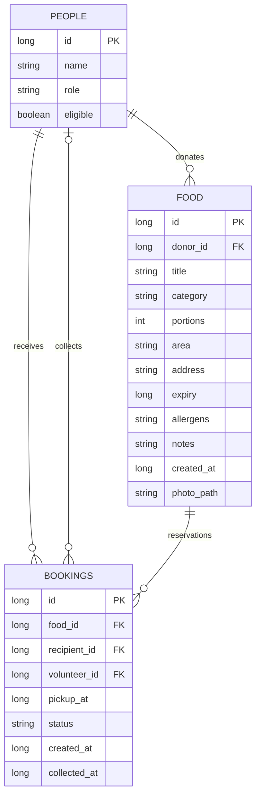
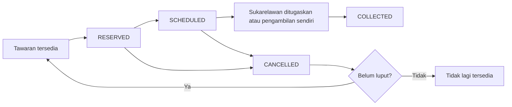

# RezekiShare — Community Food Rescue

Prototaip Android native dalam **Kotlin**, berdasarkan enam fungsi dalam soalan SWC3403/SWC3713. UI Bahasa Melayu dengan lapan foto kategori makanan sebenar dan pilihan gambar galeri. Namespace asal dikekalkan: `com.example.communityfoodrescue`. Binaan debug menggunakan application ID `com.example.communityfoodrescue.demo` supaya tidak menimpa aplikasi terdahulu pada emulator.

## Buka dan jalankan

1. Buka folder `CommunityFoodRescue` dalam Android Studio.
2. Gunakan Gradle JDK bawaan Android Studio (JDK 17 atau lebih baharu; projek ini diuji dengan JBR bawaan).
3. Pasang Android SDK **36.1** dan benarkan Gradle Sync. AGP 9.3.3 mempunyai sokongan Kotlin terbina dalam; tidak perlu menambah plugin Kotlin lama.
4. Jalankan pada emulator/peranti Android 7.0 (API 24) atau lebih baharu.
5. Profil di bahagian atas skrin boleh ditukar untuk menguji peranan. Data contoh dimasukkan sekali pada penciptaan pangkalan data.

APK debug turut disediakan berasingan. `local.properties` bergantung pada komputer; Android Studio boleh menjananya semula. Jangan muat naik fail itu, `.gradle`, `.idea`, atau folder `build` ke GitHub.

## Pemetaan enam fungsi wajib

| Kriteria | Skrin / tindakan | Kod utama |
|---|---|---|
| Surplus-food listing | Penderma → Derma → maklumat, alergen, luput → Terbitkan | `MainActivity.addScreen`, `RescueDatabase.addFood` |
| Search/filter | Teroka → carian nama/kawasan, kategori, kawasan → Cari & tapis | `MainActivity.homeScreen` |
| Reservation | Penerima layak → Tempah semua hidangan → Sahkan | `RescueDatabase.reserve` |
| Pickup scheduling | Penerima → Aktiviti → Jadualkan pengambilan | `RescueDatabase.schedule` |
| Collection-status update | Sukarelawan → Ambil tugasan → Sahkan sudah dikutip; penderma juga boleh mengesahkan | `claim`, `collect`, `cancel` |
| Donation/collection history | Sejarah → sumbangan, tempahan, kutipan, pembatalan, jumlah hidangan | `MainActivity.historyScreen` |

## Demo lengkap

1. Profil **Dapur Kak Siti**: tambah makanan baharu dengan kuantiti, kawasan, alamat, alergen dan masa luput pada masa akan datang. Tandakan pengesahan keadaan makanan.
2. Tukar profil kepada **Aina**. Cari makanan tersebut dan tempah. Satu tempahan mengambil semua hidangan dalam tawaran; tiada pembahagian kuantiti dalam prototaip ini.
3. Dalam **Aktiviti**, pilih masa pengambilan sekurang-kurangnya satu minit ke hadapan, sebelum masa luput.
4. Tukar kepada **Amir**. Dalam Aktiviti, terima tugasan yang dijadualkan.
5. Apabila tiba waktu pengambilan, tekan **Muat semula status**, kemudian **Sahkan sudah dikutip**. Bagi pengambilan sendiri, penderma boleh mengesahkan tanpa sukarelawan.
6. Lihat **Sejarah** untuk masa kutipan dan jumlah hidangan. Tutup dan buka aplikasi untuk menunjukkan data kekal.
7. Cuba profil **Penerima belum disahkan**: tidak boleh membuat tempahan. Cuba **Farah** untuk menunjukkan tawaran yang telah ditempah tidak boleh ditempah kali kedua.
8. Untuk pembatalan, penerima/penderma membuka Aktiviti dan membatalkan tempahan. Tawaran yang belum luput kembali tersedia dan rekod lama kekal.

Data contoh luput antara 24 hingga 96 jam selepas pangkalan data mula dicipta. Jika demo dibuat kemudian, tambah tawaran baharu. Kosongkan data aplikasi hanya jika sengaja mahu membuang SEMUA rekod dan menghasilkan sampel baharu.

## Penyimpanan dan struktur

SQLite dalaman (`rezeki_share.db`) melalui `SQLiteOpenHelper`; aplikasi tidak memerlukan Internet atau akaun cloud. `session` SharedPreferences menyimpan pilihan profil terakhir sahaja.





Penetapan sukarelawan menggunakan `volunteer_id`, tanpa status tambahan. Jadual hanya boleh diubah sebelum sukarelawan ditugaskan. Pembatalan kekal tersedia kepada penerima/penderma. Makanan luput tidak dipaparkan dalam carian tetapi rekodnya kekal dalam Aktiviti/Sejarah. Masa disimpan sebagai epoch milliseconds dan dipaparkan dalam waktu peranti.

Transaksi SQLite menyemak peranan, pemilikan, status, luput dan kelayakan sebelum menulis. Foreign key melindungi hubungan data. Indeks unik bersyarat menghalang lebih daripada satu tempahan bukan `CANCELLED` untuk satu tawaran. Senarai yang telah dikutip tidak boleh ditempah semula.

## Fail Kotlin

- `Models.kt`: model peranan, makanan, tempahan, dan peraturan input.
- `RescueDatabase.kt`: skema SQLite, data contoh dan operasi bertransaksi.
- `MainActivity.kt`: UI, navigasi, carian, borang dan aliran tindakan.
- `FoodPhotos.kt`: foto kategori, import galeri, pengecilan imej dan pembetulan orientasi.
- `PhotoUpgradeTest.kt`: migrasi SQLite v1 ke v2 dan kekekalan foto.
- `PHOTO_CREDITS.md`: sumber serta lesen foto Pexels.
- `FoodRulesTest.kt`: sempadan validasi masa, kuantiti dan alergen.
- `RescueDatabaseTest.kt`: ujian integrasi SQLite sebenar pada emulator.

## Ujian

```powershell
.\gradlew.bat assembleDebug testDebugUnitTest
.\gradlew.bat connectedDebugAndroidTest
```

Ujian meliputi aliran tempahan hingga kutipan, kekekalan selepas pangkalan data dibuka semula, kelayakan, tempahan berganda, pembatalan dan tempahan semula, pemilikan, konflik tugasan sukarelawan, luput dan pengambilan sebelum waktunya. Ujian menggunakan pangkalan data berasingan (`rescue-test.db`) dan tidak memadam data demo aplikasi. Untuk menguji masa kutipan tanpa menunggu, ujian sahaja mengubah masa jadual secara langsung.

## Skop prototaip

Semua profil berkongsi satu pangkalan data pada satu peranti. Pemilih profil ialah alat demo, bukan log masuk atau pengesahan identiti sebenar. Kelayakan penerima ialah data sampel, bukan proses kelulusan sebenar. Tiada pelayan, penyegerakan antara telefon, notifikasi push atau penentuan kelayakan automatik. Foto stok dilabel sebagai gambar contoh kategori. Penderma boleh menggantikannya dengan gambar makanan sendiri. Masa bergantung pada jam peranti.

Untuk sistem pengeluaran, tambah pelayan berautentikasi, pemeriksaan kebenaran pada pelayan, proses kelulusan penerima dan pengurusan penghantaran. GitHub, laporan akademik, Turnitin dan pembentangan tidak diterbitkan secara automatik. Dokumen soalan menetapkan maksimum penggunaan AI 20%; kumpulan perlu memahami, menyesuaikan dan mengisytiharkan sumbangan sebenar mengikut syarat kursus.

## Keputusan semakan — 27 September 2026

- `assembleDebug`, `testDebugUnitTest`, `assembleDebugAndroidTest`: BUILD SUCCESSFUL dalam folder projek Android Studio asal.
- 5 ujian `FoodRulesTest` dan 1 ujian templat: lulus.
- AndroidJUnitRunner pada Pixel 6 emulator: **OK (8 tests)** — 6 integrasi SQLite, 1 navigasi tiga peranan, 1 semakan konteks pakej.
- Paparan utama dan kad makanan disemak melalui tangkapan skrin emulator.
- `connectedDebugAndroidTest --offline` memerlukan komponen UTP yang tiada dalam cache mesin ini. Ujian emulator dijalankan terus melalui `adb shell am instrument -w com.example.communityfoodrescue.demo.test/androidx.test.runner.AndroidJUnitRunner` selepas memasang APK aplikasi dan APK ujian.
- Binaan di salinan dalam Documents mengalami ralat AAPT2 pada fail perantaraan. Binaan penuh terakhir berjaya dari folder `AndroidStudioProjects/CommunityFoodRescue`; gunakan folder projek asal itu untuk Run dalam Android Studio.

## Versi 1.1 — kategori dan gambar makanan

Lapan kategori: Makanan siap; Roti & pastri; Buah & sayur; Barangan kering; Mi & pasta; Sup & bubur; Kuih & pencuci mulut; Produk tenusu.

Empat tawaran demo tambahan: spageti sos tomato, sup sayur, kek vanila dan yogurt buah. Tawaran baharu ditambah sekali ketika naik taraf ke SQLite v2; rekod makanan/tempahan terdahulu dikekalkan melalui `ALTER TABLE`. Gambar kategori juga berfungsi pada rekod lama.

**Cara memilih gambar:** Profil penderma → Derma → pilih kategori → Pilih gambar dari galeri → pilih gambar → semak pratonton → lengkapkan borang → Terbitkan tawaran. Jika tiada gambar sendiri, foto contoh kategori digunakan. Butang Gunakan gambar contoh kategori membuang pilihan gambar daripada draf.

Pemilih dokumen Android hanya memberikan akses kepada gambar yang dipilih; tiada kebenaran membaca seluruh galeri diperlukan. Gambar disalin ke storan dalaman `files/food-photos`, dinormalkan orientasinya dan disimpan sebagai JPEG maksimum 1280 piksel pada sisi terpanjang. Metadata gambar asal tidak disalin. Fail import maksimum 20 MB. Memadam gambar asal dalam galeri selepas import tidak memadam salinan aplikasi. Laluan foto disimpan dalam lajur `photo_path`. Borang dan pilihan gambar dipulihkan selepas putaran skrin.

Gambar contoh disimpan di `drawable-nodpi` dan tidak memerlukan sambungan Internet. Sumber dan lesen terdapat dalam `PHOTO_CREDITS.md`. APK v1.1 boleh dipasang sebagai kemas kini kepada APK demo v1.0; jangan uninstall jika mahu mengekalkan data lama.

Semakan v1.1: binaan APK dan 6 ujian unit lulus; AndroidJUnitRunner melaporkan OK (11 tests), termasuk 3 ujian baharu bagi migrasi v1→v2, import foto kekal dan penolakan fail bukan imej. Pemilih gambar Android berjaya dibuka; semakan manual pemilihan fail hingga kembali ke pratonton tidak selesai kerana emulator tidak responsif.
